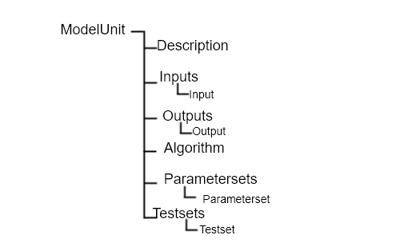

**CropML Description**
======================
| In CropML, a model is either a model unit or a composition of models. A ModelUnit  represents the atomic unit of a crop model define by the 
	modelers. A model composition  is a model resulting from the composition of two or more atomic model or composite models.
| These models have a specific formal definition in CropML.

Formal definition of a Model Unit in CropML
-------------------------------------------
| The structure of a Model Unit in CropML MUST be conform to a specific Document Type Definition
	named `ModelUnit.dtd <https://github.com/AgriculturalModelExchangeInitiative/PyCropML/blob/version2/test/data/ModelUnit.dtd>`_ .
| So a Model Unit CropML document is a XML document well-formed and also obeys the rules given in the ModelUnit structure.
| This structure MAY be described by the below tree:

.. csv-table::
   :header: "Element", "Description"
   :widths: 25, 100
   
   "ModelUnit", " The root of an atomic model in CropML which make the difference from a composite model."
   "Description", " some basic information related to the name of the model, its authors and others elements used to reference it."
   "Inputs", " A list of inputs characterized by their names, initial states, the range of values and others. Its input variables are related to climate, soil and cropping system"
   "Outputs", " A list of outputs defining the processes involved, the variables whose dynamics we want to observe."
   "Algorithm", " The description of the behaviour of the model made by the mathematical relationship between the inputs and the outputs with some control structure."
   "Parametersets", " Some sets of parameters which are invariant and used for the simulation of the models."
   "Testsets", " Set of model configuration used to compare estimated and desired outputs  ."

| In the next, we define the major elements of a CropML model unit.

ModelUnit element
^^^^^^^^^^^^^^^^^
| An atomic model in CropML is declared with `<<ModelUnit>> <https://github.com/AgriculturalModelExchangeInitiative/PyCropML/blob/master/src/pycropml/modelunit.py>`_ element,
	the usual root of CropML ModelUnit document.
	
.. code-block:: xml

		<?xml version="1.0" encoding="utf-8"?>
		<!DOCTYPE ModelUnit PUBLIC "-//SIMPLACE/DTD SOL 1.0//EN" "https://raw.githubusercontent.com/AgriculturalModelExchangeInitiative/xml_representation/master/ModelUnit.dtd">
		<ModelUnit modelid=" " timestep=" " name=" " version="">
			....
		</ModelUnit>

| This element MUST contain a Description, an Algorithm, Parametersets and Testsets elements and
	MAY optionally have Inputs and Outputs elements. The restriction of the length of different lists is not imposed.
| ModelUnit element MUST have an modelid and name attributes which are used to reference an atomic model. It MUST also contain a timestep attribute to define the temporality of the model and
   a version attribute for each version of the model.
	
Description element
^^^^^^^^^^^^^^^^^^^
This element gives the general information on the model and is composed by a set of character elements. It MUST contain
Title, Authors, Institution and abstract elements and MAY optionally contain URI and Reference elements.

.. code-block:: xml
		
		<ModelUnit modelid=" " timestep=" " name=" " version =" ">
			<Description>
				<Title>title</Title>
				<Authors>authors</Authors>
				<Institution>institution</Institution>
				<URI>uri</URI>
				<Abstract><![CDATA[abstract]]></Abstract>
			</Description>
			...
		</ModelUnit>

Inputs elements
^^^^^^^^^^^^^^^
The inputs of Model are listed inside an XML element called Inputs within a `dictionary structure  <https://github.com/AgriculturalModelExchangeInitiative/PyCropML/blob/version2/src/pycropml/inout.py>`_ 
composed by their attributes which declarations are optional(default, max, min, parametercategory, variablecategory and uri) or required(name, datatype, description, inputtype,
unit ) and their corresponding value. *Inputs* element MUST contain one or more *Input* elements.

.. code-block:: xml

      <ModelUnit modelid=" " timestep=" " name=" " version =" ">
         ...
         <Inputs>
            <Input name=" " description=" " parametercategory=" " datatype=" " min=" " max=" " default=" " unit=" " uri="" inputtype=" "/>
            <Input name=" " description=" " parametercategory=" " datatype=" " min=" " max=" " default=" " unit=" " uri=" " inputtype=" "/>
            ...
         </Inputs>
         ...
      </ModelUnit>

* The required *datatype* attribute is the type of input value specified in *default* (the default value in the input), *min* (the minimum value in the input) and *max* (the maximum value in the input). It MAY be one type of the set of types used in the existing crop modeling platform.

* The *inputtype* attribute makes it possible to distinguish the variables and the parameters of the model. So it MUST take one of two possible values: *parameter* and *variable*.

* The *parametercategory* attribute defines the category of parameter which is specified by one of the following values: *constant*, *species*, *soil* and *genotypic*.

* The *variablecategory* defines the category of variable depending on whether it is a *state*, a *rate* or an "auxiliary" variable.  State variable characterize the behavior of the model and rate variable characterizes the changes in state variables.

Outputs element
^^^^^^^^^^^^^^^
The outputs of Model are listed inside an XML element called Outputs within a `dictionary structure <https://github.com/AgriculturalModelExchangeInitiative/PyCropML/blob/version2/src/pycropml/inout.py>`_  
composed by their attributes which declarations are:

*    optional(variabletype and URI) 

*    required(name, datatype, description, unit, max and min ) 

*	 and their corresponding value

*Outputs* MUST contain zero or more output elements. 

.. code-block:: xml

      <ModelUnit modelid=" " timestep=" " name=" " version =" ">
         ...
         <Outputs>
            <Output name=" " description=" " datatype=" " min=" " max=" "  unit=" " uri=" "/>
            <Output name=" " description=" " datatype=" " min=" " max=" "  unit=" " uri=" "/>
            ...
         </Outputs>
         ...
      </ModelUnit>

| The definition of different attributes is same as Input's attributes.

Algorithm element
^^^^^^^^^^^^^^^^^
| The *Algorithm* element defines the building block of CropML model unit and shows the computational method to determine
	the outputs from the inputs. 
| It consists of a set of mathematical equations (relation between inputs), loops and conditional instructions 
	which are well structured in a specific *language*, the algorithm's attribute.
   
.. code-block:: xml

      <ModelUnit modelid=" " timestep=" " name=" " version =" ">
         ...
         <Algorithm language =""><![CDATA[
            ...
            ]]>
         </Algorithm>
         ...
      </ModelUnit>
   
Parametersets element
^^^^^^^^^^^^^^^^^^^^^
| *Parametersets* element contains one or more *Parameterset* elements that define the different ways of setting the model.
	Each *Parameterset* element MUST have *name* and *description* attributes that respectively represents the name and the description of each setting.

| The different parameterset MUST contain a list of Param elements that show in attribute the name of the parameter (an input 
	which inputtype equals *parameter*) and the fixed value of this one.

.. code-block:: xml

     <ModelUnit modelid=" " timestep=" " name=" " version =" ">
         ...
         <Parametersets>
            <Parameterset name="" description="" uri = ""/>
            <Parameterset name="" description="" >            
               <Param name="">value</Param>
               <Param name="">value</Param>
               ...
            </Parameterset>
            ...
         ...
      </ModelUnit>
           

Testsets element
^^^^^^^^^^^^^^^^
| *Testsets* element contains one or more *Testset* elements that define the different run for evaluating the outputs of the model.

| Each *Testset* element MUST have *name*, *description* and *parameterset* attributes that respectively represents the name, 
	the description of each run and the name of the parameterset related to the Testset. This one allow to retrieve the name and the value of different
	parameters includes in this parameterset.
	
| The different Testset MUST contain a list of InputValue and OutputValue elements corresponding respectively to the values
	of inputs used in the run and the values of Outputs that will be asserted.
   
.. code-block:: xml

      <ModelUnit modelid=" " timestep=" " name=" " version =" ">
         ...
         <Testsets>
            <Testset name="" parameterset = "" description="" uri = ""/>
            <Testset name="" parameterset = "" description="" >            
               <Test name="">
                  <InputValue name="">value</InputValue>
                  ...
                  <OutputValue name="" precision ="">value</OutputValue>
                  ...
               </Test>                 
               ...
            </Testset>
            ...
        </Testsets>
        ...
      </ModelUnit>

Formal definition of a Composite Model in CropML
------------------------------------------------
| A Composite Model CropML is an assembly of processes which are described by a set of model units or a composition of models.
   Given a composite model is a model, this one has also inputs, outputs and internal state which describe the orchestration of different 
   independent models composed.

| The structure of a Composite Model in CropML MUST conform to a specific Document Type Definition
	named `ModelComposition.dtd <https://github.com/AgriculturalModelExchangeInitiative/PyCropML/blob/version2/test/data/ModelComposition.dtd>`_ .
   
| The composition is represented as a directed port graph of models:

    | Vertices are the different models that form the composition.
    | Ports are the inputs and outputs of each model.
    | Edges are directed and connect one output port to an input port of another model.

| It contains in addition to all Elements of a model unit a Composition Element for the composition of models.
| This structure MAY be described by the below tree:

.. image:: images/modelcomposition.png

| In the next, we define the major elements of a CropML model unit.

	
Inputs element
^^^^^^^^^^^^^^
It MUST contain one or more *input* element which provide a set of independent models entries. 
If two or more input variables of independent models are the same (same unit, interval, description)
a link should be made to one input variable of the composite model.

Outputs element
^^^^^^^^^^^^^^^
It MUST contain one or more *output* element which provide a set of independent models outputs or a result of a combination of models . 

Composition element
^^^^^^^^^^^^^^^^^^^
It's a list of *models* elements which contains a list of *links* elements.
Link provides the mechanism for mapping inputs declared within one modelUnit to output in another modelUnit, 
allowing information to be exchanged between the various atomic models in the composite model.

Algorithm element
-----------------
The implementation differs from the platform:

	* Discrete Events Models and Formalisms (RECORD)
	* Actor model framework (OpenAlea)
	* A sequence of algorithmic instructions witch implement the control flow (BIOMA)