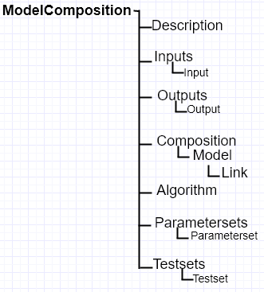

**CropML Description**
======================
| In CropML, a model is either a model unit or a composition of models. A ModelUnit  represents the atomic unit of a crop model define by the 
	modelers. A model composition  is a model resulting from the composition of two or more atomic model or composite models.
| These models have a specific formal definition in CropML.

Formal definition of a Model Unit in CropML
-------------------------------------------
| The structure of a Model Unit in CropML MUST be conform to a specific Document Type Definition
	named `ModelUnit.dtd <https://github.com/AgriculturalModelExchangeInitiative/PyCropML/blob/version2/test/data/ModelUnit.dtd>`_ .
| So a Model Unit CropML document is a XML document well-formed and also obeys the rules given in the ModelUnit structure.
| This structure MAY be described by the below tree:

.. image:: images/modelunit.png

| For more details, consult Crop2ML model unit specification `Crop2ML documentation <https://crop2ml.readthedocs.io/en/latest/user/specifications/specM2.html>`_ .

Formal definition of a Composite Model in CropML
------------------------------------------------
| A Composite Model CropML is an assembly of processes which are described by a set of model units or a composition of models.
   Given a composite model is a model, this one has also inputs, outputs and internal state which describe the orchestration of different 
   independent models composed.

| The structure of a Composite Model in CropML MUST conform to a specific Document Type Definition
	named `ModelComposition.dtd <https://github.com/AgriculturalModelExchangeInitiative/PyCropML/blob/version2/test/data/ModelComposition.dtd>`_ .
   
| The composition is represented as a directed port graph of models:

    | Vertices are the different models that form the composition.
    | Ports are the inputs and outputs of each model.
    | Edges are directed and connect one output port to an input port of another model.

| It contains in addition to all Elements of a model unit a Composition Element for the composition of models.
| This structure MAY be described by the below tree:

| | For more details, consult Crop2ML model unit specification `Crop2ML documentation <https://crop2ml.readthedocs.io/en/latest/user/specifications/specM3.html>`_ .

